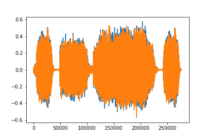
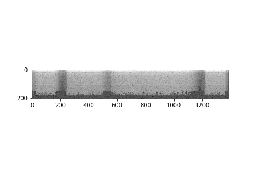
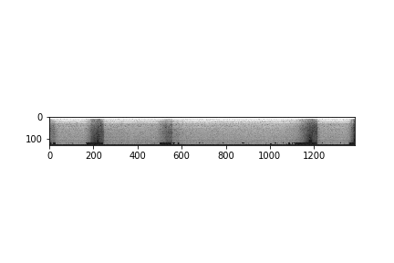
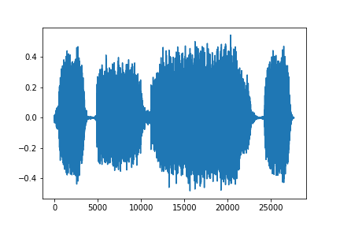
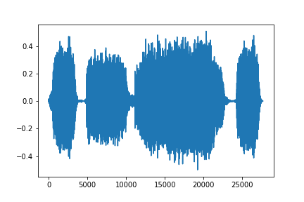
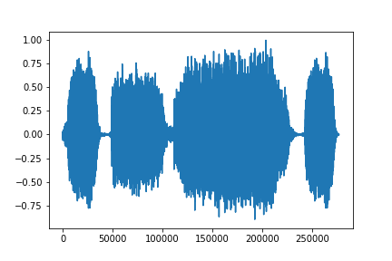
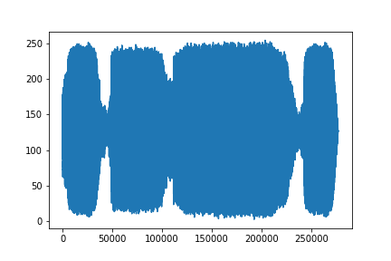
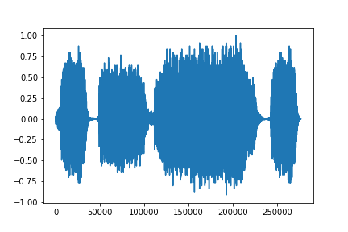

Torch Audio Tutorial
===================

Significant effort in solving machine learning problems goes into data
preparation. PyTorch provides many tools to make data loading easy and
more readable. In this tutorial, we will see how to load and preprocess
data from a simple dataset.

For this tutorial, please make sure the ``matplotlib`` package is
installed for easier visualization.

.. code:: ipython3

    import torch
    import torchaudio
    import matplotlib
    %matplotlib inline
    import matplotlib.pyplot as plt

Opening a dataset
-----------------

Torch audio supports loading sound files in the wav and mp3 format.

.. code:: ipython3

    filename = "_static/sound/steam-train-whistle-daniel_simon-converted-from-mp3.wav"
    tensor, frequency = torchaudio.load(filename)

    tensor.size()
    # torch.Size([2, 276858])
    frequency
    # 44100

.. code:: ipython3

    ith_sample = 0
    tensor = dataset[ith_sample][0]
    
    tensor.size()
    # torch.Size([1, 235536])

    plt.plot(tensor.transpose(0,1).numpy())

Transformations
---------------

Torch audio supports a growing list of
`transformations <https://pytorch.org/audio/transforms.html>`__.

-  **Scale**: Scale audio tensor from a 16-bit integer (represented as a
   FloatTensor) to a floating point number between -1.0 and 1.0. Note
   the 16-bit number is called the “bit depth” or “precision”, not to be
   confused with “bit rate”.
-  **PadTrim**: PadTrim a 2d-Tensor
-  **Downmix**: Downmix any stereo signals to mono.
-  **LC2CL**: Permute a 2d tensor from samples (n x c) to (c x n).
-  **Resample**: Resample the signal to a different frequency.
-  **Spectrogram**: Create a spectrogram from a raw audio signal
-  **MelScale**: This turns a normal STFT into a mel frequency STFT,
   using a conversion matrix. This uses triangular filter banks.
-  **SpectrogramToDB**: This turns a spectrogram from the
   power/amplitude scale to the decibel scale.
-  **MFCC**: Create the Mel-frequency cepstrum coefficients from an
   audio signal
-  **MelSpectrogram**: Create MEL Spectrograms from a raw audio signal
   using the STFT function in PyTorch.
-  **BLC2CBL**: Permute a 3d tensor from Bands x Sample length x
   Channels to Channels x Bands x Samples length.
-  **MuLawEncoding**: Encode signal based on mu-law companding.
-  **MuLawExpanding**: Decode mu-law encoded signal.

Since all transforms are nn.Modules or jit.ScriptModules, they can be
used as part of a neural network at any point.

To start, we can look at the log of the spectrogram on a log scale.

.. code:: ipython3

    spec = torchaudio.transforms.Spectrogram()(tensor)
    spec.size()
    # torch.Size([1, 1178, 201])

    plt.imshow(spec.log2().transpose(1,2)[0,:,:].numpy(), cmap='gray')

Or we can look at the Mel Spectrogram on a log scale.

.. code:: ipython3

    mel = torchaudio.transforms.MelSpectrogram()(tensor)

    mel.size()
    # torch.Size([1, 1178, 128])

    plt.imshow(mel.log2().transpose(1,2)[0,:,:].detach().numpy(), cmap='gray')

We can resample the signal, one channel at a time.

.. code:: ipython3

    new_frequency = frequency/10

    # Since Resample applies to a single channel, we resample first channel here
    resampled = torchaudio.transforms.Resample(frequency, new_frequency)(tensor[0,:].view(1,-1))
    resampled.size()
    # torch.Size([1, 27686])

    plt.plot(resampled[0,:].numpy())

Or we can first convert the stereo to mono, and resample, using
composition.

.. code:: ipython3

    resampled = torchaudio.transforms.Compose([
        torchaudio.transforms.LC2CL(),
        torchaudio.transforms.DownmixMono(),
        torchaudio.transforms.LC2CL(),
        torchaudio.transforms.Resample(frequency, new_frequency)
    ])(tensor)

    resampled.size()
    # torch.Size([1, 27686])

    plt.plot(resampled[0,:].numpy())

As another example of transformations, we can encode the signal based on
the Mu-Law companding. But to do so, we need the signal to be between -1
and 1. Since the tensor is just a regular PyTorch tensor, we can apply
standard operators on it.

.. code:: ipython3

    # Let's check if the tensor is in the interval [-1,1]
    tensor.min(), tensor.max(), tensor.mean()
    # (tensor(-0.5728), tensor(0.5760), tensor(9.2938e-05))

    def normalize(tensor):
        # Subtract the mean, and scale to the interval [-1,1]
        tensor_minusmean = tensor - tensor.mean()
        return tensor_minusmean/tensor_minusmean.abs().max()
    
    normalized = normalize(tensor)  # Let's normalize to the full interval [-1,1]
    
    plt.plot(normalized[0,:].numpy())

.. code:: ipython3

    transformed = torchaudio.transforms.MuLawEncoding()(normalized)

    transformed.size()
    # torch.Size([2, 276858])

    plt.plot(transformed[0,:].numpy())

.. code:: ipython3

    recovered = torchaudio.transforms.MuLawExpanding()(transformed)

    recovered.size()
    # torch.Size([2, 276858])

    plt.plot(recovered[0,:].numpy())

.. code:: ipython3

    recovered = torchaudio.transforms.MuLawExpanding()(transformed)
    
    def compute_median_relative_difference(normalized, recovered):
        diff = (normalized-recovered)
        return (diff.abs()/normalized.abs()).median()
    
    # Median relative difference between original and MuLaw reconstucted signals
    compute_median_relative_difference(normalized, recovered)
    # tensor(0.0122)

Migrating to Torch Audio from Kaldi
-----------------------------------

Users may be familiar with
`Kaldi <http://github.com/kaldi-asr/kaldi>`__, a toolkit for speech
recognition. Torch Audio offers compatibility with it in
``torchaudio.kaldi_io``. It can indeed read from kaldi scp, or ark file
or streams with:

-  read_vec_int_ark
-  read_vec_flt_scp
-  read_vec_flt_arkfile/stream
-  read_mat_scp
-  read_mat_ark

Conclusion
----------

We used the VCTK dataset to illustrate how to open a dataset or
another data using Torch Audio, and how to pre-process and transform an
audio signal. Given that Torch Audio is built on PyTorch, these
techniques can be used as building blocks for more advanced audio
applications, such as speech recognition.
